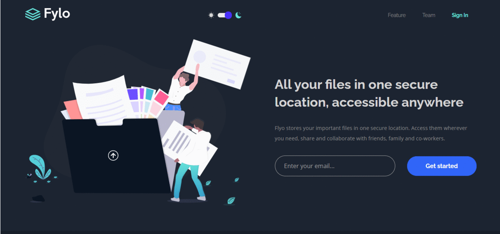

<!DOCTYPE html>
<h1 align="center">Fylo - landing page with React </h1>

<div align="center">
  <a href="https://fylo-cloud-landing-page-with-react.netlify.app/" target="_blank">See Live</a>
</div>

<p align="center">This is a cloud storage landing page build using React with dark theme added.</p>

<!-- badges -->
<div align="center">
  
  
</div>

<!-- screen shot -->
<div style="margin: 2rem 0">
  
</div>

## Getting Started

To get started, you can download a local copy of the repository and or see live <a href="https://fylo-cloud-landing-page-with-react.netlify.app/" target="_blank">here</a>.

### Prerequisites

Before running this project locally, you should have installed node and npm on your PC. <br>

### After installing node and npm,

### Run these commands

- Install all the dependencies for this project

  ```
  npm install
  ```

- Run locally
  ```
  npm start
  ```

After running these commands, this website should have launched in your default browser.

## Built With

- [React](https://reactjs.org/) - JavaScript library for building user interfaces
- [Sass](https://sass-lang.com/) - Preprocessor scripting language for CSS

## License

This project is licensed under the [MIT License](https://opensource.org/licenses/MIT)

## Acknowledgments

This project was build by taking challenge on [Frontend Mentor](https://www.frontendmentor.io/profile/ramankarki)
